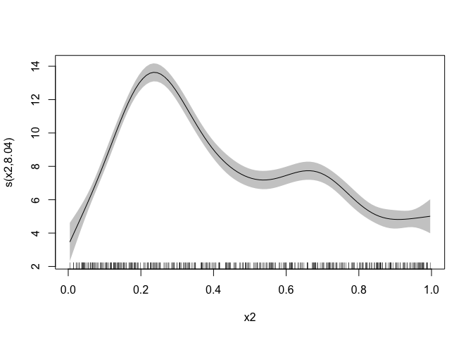
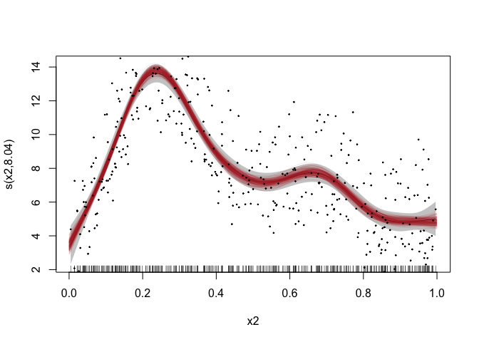

<!-- README.md is generated from README.Rmd. Please edit that file -->

# greta.gam: generalised additive models in greta using mgcv

<!-- badges: start -->

[](https://github.com/greta-dev/greta.gam/actions/workflows/R-CMD-check.yaml)
[](https://app.codecov.io/gh/greta-dev/greta.gam?branch=main)
<!-- badges: end -->

greta.gam lets you use [mgcv](https://CRAN.R-project.org/package=mgcv)’s
smoother functions and formula syntax to define smooth terms for use in
a [greta](https://greta-stats.org/) model. You can then define your own
likelihood to complete the model, and fit it by MCMC.

The design and architecture of the package was done by [Nick
Golding](https://github.com/goldingn), and [David L
Miller](https://github.com/dill).

# Installation

You can install the development version of `greta.gam` from the
[R-universe](https://greta-dev.r-universe.dev/greta.gam) with:

``` r
install.packages("greta.gam", repos = c("https://greta-dev.r-universe.dev", "https://cloud.r-project.org"))
```

Or you can install from CRAN with:

``` r
install.packages("greta.gam")
```

## Example

Here’s a simple example adapted from the `mgcv` `?gam` help file. In
`mgcv`:

``` r
library(mgcv)
#> Loading required package: nlme
#> This is mgcv 1.9-1. For overview type 'help("mgcv-package")'.
set.seed(2024 - 12 - 12)

# simulate some data...
dat <- gamSim(1, n = 400, dist = "normal", scale = 0.3)
#> Gu & Wahba 4 term additive model
head(dat)
#>           y        x0        x1        x2        x3         f       f0       f1
#> 1  6.189450 0.1965959 0.4034173 0.7343655 0.7300751  5.759744 1.158200 2.240804
#> 2 11.198472 0.7164260 0.8771072 0.1027748 0.6644855 11.004222 1.555243 5.778906
#> 3  5.100980 0.3620857 0.4601120 0.8524531 0.9341949  4.681517 1.815195 2.509852
#> 4  7.441910 0.3910775 0.5848327 0.7292472 0.5560306  7.557107 1.884044 3.220915
#> 5  7.617724 0.8133072 0.6959593 0.7285362 0.6814503  7.594086 1.106920 4.022560
#> 6  7.668790 0.4279599 0.3961759 0.5802106 0.3974592  7.235281 1.948997 2.208585
#>          f2 f3
#> 1 2.3607405  0
#> 2 3.6700722  0
#> 3 0.3564696  0
#> 4 2.4521485  0
#> 5 2.4646055  0
#> 6 3.0776995  0
# fit a model using gam()
mgcv_fit <- gam(y ~ s(x2), data = dat)
mgcv_fit
#> 
#> Family: gaussian 
#> Link function: identity 
#> 
#> Formula:
#> y ~ s(x2)
#> 
#> Estimated degrees of freedom:
#> 8.04  total = 9.04 
#> 
#> GCV score: 3.829468
summary(mgcv_fit)
#> 
#> Family: gaussian 
#> Link function: identity 
#> 
#> Formula:
#> y ~ s(x2)
#> 
#> Parametric coefficients:
#>             Estimate Std. Error t value Pr(>|t|)    
#> (Intercept)  8.08745    0.09673    83.6   <2e-16 ***
#> ---
#> Signif. codes:  0 '***' 0.001 '**' 0.01 '*' 0.05 '.' 0.1 ' ' 1
#> 
#> Approximate significance of smooth terms:
#>         edf Ref.df     F p-value    
#> s(x2) 8.036  8.749 91.18  <2e-16 ***
#> ---
#> Signif. codes:  0 '***' 0.001 '**' 0.01 '*' 0.05 '.' 0.1 ' ' 1
#> 
#> R-sq.(adj) =  0.667   Deviance explained = 67.4%
#> GCV = 3.8295  Scale est. = 3.743     n = 400
## show partial residuals
plot(mgcv_fit, scheme = 1, shift = coef(mgcv_fit)[1])
```



Now fitting the same model in `greta`. We first start by setting up the
linear predictor for the smooth. That is, the right hand side of the
formula:

``` r
library(greta.gam)
#> Loading required package: greta
#> 
#> Attaching package: 'greta'
#> The following objects are masked from 'package:stats':
#> 
#>     binomial, cov2cor, poisson
#> The following objects are masked from 'package:base':
#> 
#>     %*%, apply, backsolve, beta, chol2inv, colMeans, colSums, diag,
#>     eigen, forwardsolve, gamma, identity, rowMeans, rowSums, sweep,
#>     tapply
set.seed(2024 - 02 - 09)
# setup the linear predictor for the smooth
linear_predictor <- smooths(~ s(x2), data = dat)
#> ℹ Initialising python and checking dependencies, this may take a moment.
#> ✔ Initialising python and checking dependencies ... done!               
linear_predictor
#> greta array <operation>
#>       [,1]
#>  [1,]  ?  
#>  [2,]  ?  
#>  [3,]  ?  
#>  [4,]  ?  
#>  [5,]  ?  
#>  [6,]  ?  
#>  [7,]  ?  
#>  [8,]  ?  
#>  [9,]  ?  
#> [10,]  ?
#> 
#> ℹ 390 more values
#> Use `print(n = ...)` to see more values
```

Now we specify the distribution of the response:

``` r
dist_sd <- cauchy(0, 1, truncation = c(0, Inf))
distribution(dat$y) <- normal(mean = linear_predictor, sd = dist_sd)
```

Now let’s make some prediction data

``` r
pred_dat <- data.frame(
  x2 = seq(0, 1, length.out = 100)
  )

head(pred_dat)
#>           x2
#> 1 0.00000000
#> 2 0.01010101
#> 3 0.02020202
#> 4 0.03030303
#> 5 0.04040404
#> 6 0.05050505
```

We run `evaluate_smooths` on the linear predicting with the new
prediction data

``` r
linear_preds <- evaluate_smooths(linear_predictor, newdata = pred_dat)
linear_preds
#> greta array <operation>
#> 
#>       [,1]
#>  [1,]  ?  
#>  [2,]  ?  
#>  [3,]  ?  
#>  [4,]  ?  
#>  [5,]  ?  
#>  [6,]  ?  
#>  [7,]  ?  
#>  [8,]  ?  
#>  [9,]  ?  
#> [10,]  ?
#> 
#> ℹ 90 more values
#> Use `print(n = ...)` to see more values
```

Now we specify that as a model object and then fit with MCMC as we do
with greta normally:

``` r
# build model
m <- model(linear_preds)
m
#> greta model
# draw from the posterior
draws <- mcmc(m, n_samples = 200, verbose = FALSE)
class(draws)
#> [1] "greta_mcmc_list" "mcmc.list"
# 4 chains
length(draws)
#> [1] 4

# 200 draws, 100 predictors
dim(draws[[1]])
#> [1] 200 100

# look at the top corner
draws[[1]][1:5, 1:5]
#>   linear_preds[1,1] linear_preds[2,1] linear_preds[3,1] linear_preds[4,1]
#> 1          2.820715          3.423075          4.025365          4.627335
#> 2          3.013640          3.578321          4.142931          4.707219
#> 3          3.209931          3.745096          4.280535          4.817052
#> 4          3.297851          3.801321          4.305055          4.809836
#> 5          3.058942          3.557204          4.055727          4.555285
#>   linear_preds[5,1]
#> 1          5.228422
#> 2          5.270628
#> 3          5.356083
#> 4          5.317095
#> 5          5.057305
```

Now let’s compare the `mgcv` model fit to the `greta.gam` fit:

``` r
plot(mgcv_fit, scheme = 1, shift = coef(mgcv_fit)[1])

# add in a line for each posterior sample
apply(draws[[1]], 1, lines, x = pred_dat$x2, 
      col = adjustcolor("firebrick", alpha.f = 0.1))
#> NULL

# plot the data
points(dat$x2, dat$y, pch = 19, cex = 0.2)
```



The `mgcv` predictions are in the grey ribbon, and the `greta.gam` ones
are in red - we can see that the greta predictions are within the range
of the mgcv, which is good news!

## Brief technical details

`greta.gam` uses a few tricks from the `jagam` (Wood, 2016) routine in
`mgcv` to get things to work. Here are some brief details for those
interested in the internal workings.

### Bayesian interpretation of the GAM

GAMs are models with Bayesian interpretations (even when fitted using
“frequentist” methods). One can think of the smoother penalty matrix as
a prior precision matrix in a Bayesian random effects model. Design
matrices are constructed exactly as in the frequentist case. See [Miller
(2021)](https://arxiv.org/abs/1902.01330) for more background on this.

### Penalty matrices

There is a slight difficulty in the Bayesian interpretation of the GAM
in that, in their naïve form the priors are improper as the nullspace of
the penalty (in the 1D case, usually the linear term). To get proper
priors we can use one of the “tricks” employed in Marra & Wood (2011) –
that is to somehow penalise the parts of the penalty that lead to the
improper prior. We take the option provided by `jagam` and create an
additional penalty matrix for these terms (from an eigen-decomposition
of the penalty matrix; see Marra & Wood, 2011).

# References

Marra, G and Wood, SN (2011) Practical variable selection for
generalized additive models. Computational Statistics and Data Analysis,
55, 2372–2387.

Miller DL (2021). Bayesian views of generalized additive modelling.
arXiv.

Wood, SN (2016) Just Another Gibbs Additive Modeler: Interfacing JAGS
and mgcv. Journal of Statistical Software 75, no. 7
