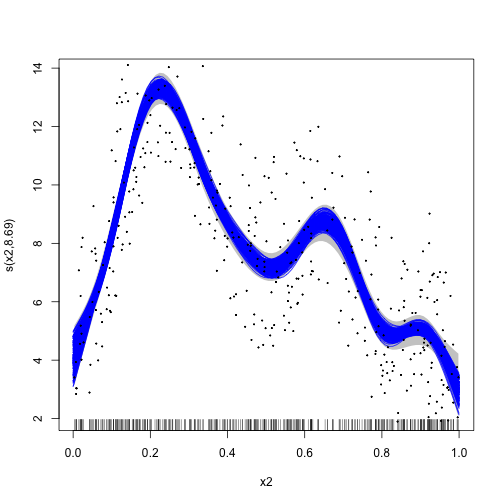

## greta.gam

### Generalised additive models in greta using mgcv.

greta.gam lets you use [mgcv](https://CRAN.R-project.org/package=mgcv)'s smoother functions and formula syntax to define smooth terms for use in a [greta](https://greta-dev.github.io/greta) model.
You can then define your own likelihood to complete the model, and fit it by MCMC.

This is work in progress!


### Example

Here's a simple example adapted from the `mgcv` `?gam` help file:

In `mgcv`:


```r
library(mgcv)
```

```
## Loading required package: nlme
```

```
## This is mgcv 1.8-41. For overview type 'help("mgcv-package")'.
```

```r
set.seed(2)

# simulate some data...
dat <- gamSim(1, n=400, dist="normal", scale=0.3)
```

```
## Gu & Wahba 4 term additive model
```

```r
# fit a model using gam()
b <- gam(y~s(x2), data=dat)
```

Now fitting the same model in `greta`:


```r
library(greta)
```

```
## 
## Attaching package: 'greta'
```

```
## The following objects are masked from 'package:stats':
## 
##     binomial, cov2cor, poisson
```

```
## The following objects are masked from 'package:base':
## 
##     %*%, apply, backsolve, beta, chol2inv, colMeans, colSums, diag,
##     eigen, forwardsolve, gamma, identity, rowMeans, rowSums, sweep,
##     tapply
```

```r
library(greta.gam)

# setup the linear predictor for the smooth
z <- smooths(~s(x2), data = dat)
```

```
## ℹ Initialising python and checking dependencies, this may take a moment.
```

```
## 
✔ Initialising python and checking dependencies ... done!
```

```r
# set the distribution of the response
distribution(dat$y) <- normal(z, 1)

# make some prediction data
pred_dat <- data.frame(x2 = seq(0, 1, length.out=100))

# z_pred stores the predictions
z_pred <- evaluate_smooths(z, newdata = pred_dat)

# build model
m <- model(z_pred)

# draw from the posterior
draws <- mcmc(m, n_samples = 200, one_by_one=TRUE)
```

```
## running 4 chains simultaneously on up to 8 cores
```

```
## 
    warmup                                           0/1000 | eta:  ?s          
    warmup ==                                       50/1000 | eta: 41s          
    warmup ====                                    100/1000 | eta: 29s          
    warmup ======                                  150/1000 | eta: 25s          
    warmup ========                                200/1000 | eta: 22s          
    warmup ==========                              250/1000 | eta: 19s          
    warmup ===========                             300/1000 | eta: 17s          
    warmup =============                           350/1000 | eta: 15s          
    warmup ===============                         400/1000 | eta: 14s          
    warmup =================                       450/1000 | eta: 13s          
    warmup ===================                     500/1000 | eta: 12s          
    warmup =====================                   550/1000 | eta: 11s          
    warmup =======================                 600/1000 | eta: 10s          
    warmup =========================               650/1000 | eta:  8s          
    warmup ===========================             700/1000 | eta:  7s          
    warmup ============================            750/1000 | eta:  6s          
    warmup ==============================          800/1000 | eta:  5s          
    warmup ================================        850/1000 | eta:  4s          
    warmup ==================================      900/1000 | eta:  2s          
    warmup ====================================    950/1000 | eta:  1s          
    warmup ====================================== 1000/1000 | eta:  0s          
## 
  sampling                                            0/200 | eta:  ?s          
  sampling ==========                                50/200 | eta:  6s          
  sampling ===================                      100/200 | eta:  4s          
  sampling ============================             150/200 | eta:  2s          
  sampling ======================================   200/200 | eta:  0s
```

```r
# plot the mgcv fit
plot(b, scheme=1, shift=coef(b)[1])

# add in a line for each posterior sample
apply(draws[[1]], 1, lines, x = pred_dat$x2, col = "blue")
```

```
## NULL
```

```r
# plot the data
points(dat$x2, dat$y, pch = 19, cex = 0.2)
```



### Brief technical details

`greta.gam` uses a few tricks from the `jagam` (Wood, 2016) routine in `mgcv` to get things to work. Here are some brief details for those interested in the internal workings...

#### Bayesian interpretation of the GAM

GAMs are models with Bayesian interpretations (even when fitted using "frequentist" methods). One can think of the smoother penalty matrix as a prior precision matrix in a Bayesian random effects model. Design matrices are constructed exactly as in the frequentist case. See [Miller (2021)](https://arxiv.org/abs/1902.01330) for more background on this.

#### Penalty matrices

There is a slight difficulty in the Bayesian interpretation of the GAM in that, in their naïve form the priors are improper as the nullspace of the penalty (in the 1D case, usually the linear term). To get proper priors we can use one of the "tricks" employed in Marra & Wood (2011) -- that is to somehow penalise the parts of the penalty that lead to the improper prior. We take the option provided by `jagam` and create an additional penalty matrix for these terms (from an eigen-decomposition of the penalty matrix; see Marra & Wood, 2011).


#### References

Marra, G and Wood, SN (2011) Practical variable selection for generalized additive models. Computational Statistics and Data Analysis, 55, 2372–2387.

Miller DL (2021). Bayesian views of generalized additive modelling. arXiv.

Wood, SN (2016) Just Another Gibbs Additive Modeler: Interfacing JAGS and mgcv. Journal of Statistical Software 75, no. 7

